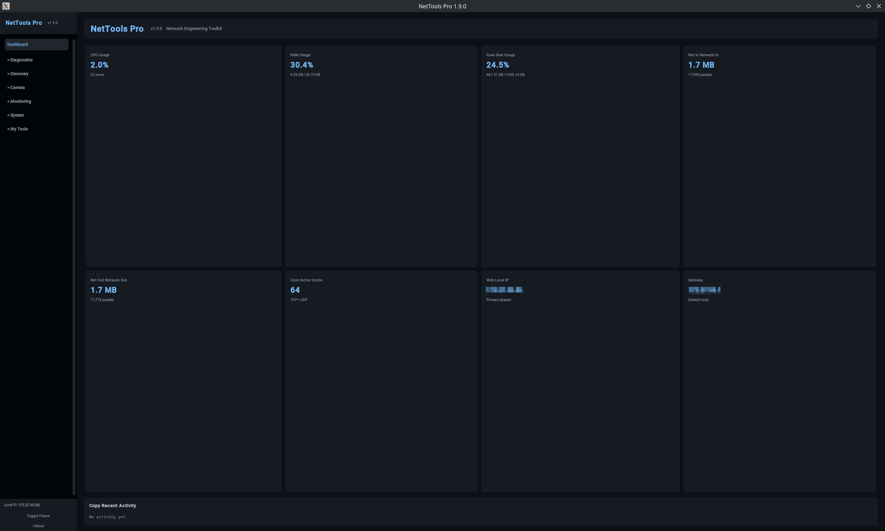
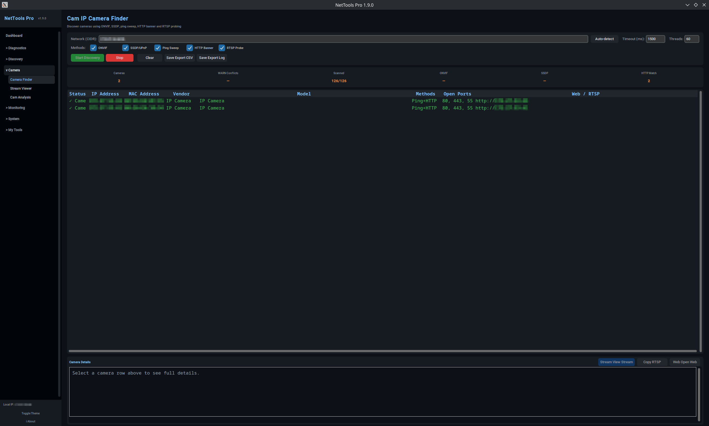
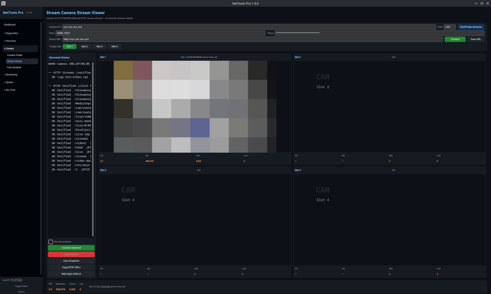
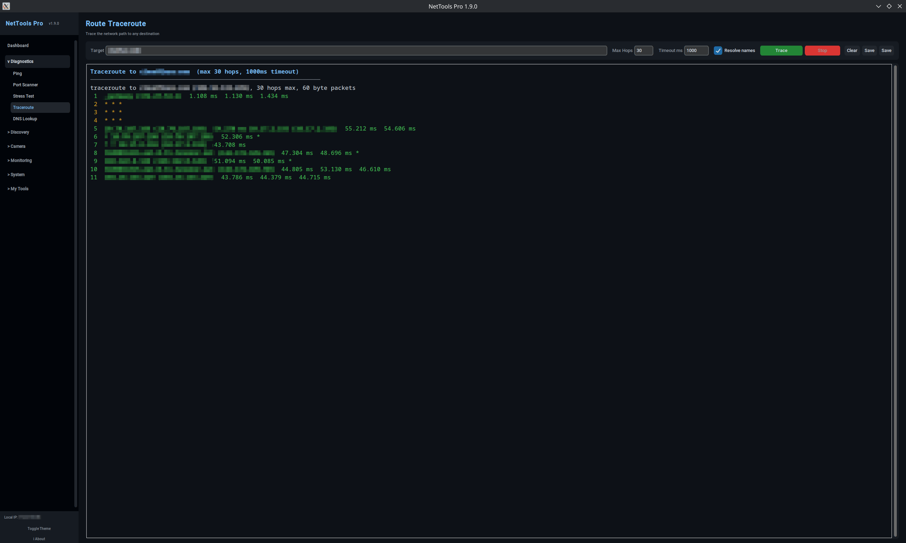

# NetTools Pro

Cross-platform network diagnostics, camera discovery, stream viewing, and system utility toolkit.


---

## Overview

NetTools Pro is a portable desktop toolkit for practical network diagnostics, IP camera discovery and live stream viewing, monitoring, and common system utility workflows. It is built with Python and CustomTkinter and runs on both Windows and Linux.

The application is intended for IT technicians, network administrators, field service work, and lab/diagnostic use. All actions are user-controlled and run locally on the operator's machine.

---

## Screenshots

### Dashboard



### Camera Discovery



### Stream Viewer



### Traceroute



---

## Latest Release

| Platform | Asset | Notes |
|---|---|---|
| Windows x64 | `NetToolsPro-windows-x64.exe` | Portable executable |
| Linux x86_64 | `NetToolsPro-linux-x86_64.bin` | Portable Linux binary |

Release assets are published on the [GitHub Releases page](https://github.com/ZodiacNor/NetToolsPro/releases).

SHA-256 checksums are included with each release as `SHA256SUMS.txt`.

### Windows usage

Download `NetToolsPro-windows-x64.exe` from the latest release and run it.

Some diagnostics or system-level operations may require Administrator privileges.

### Linux usage

Download `NetToolsPro-linux-x86_64.bin` from the latest release and run it:

```bash
chmod +x NetToolsPro-linux-x86_64.bin
./NetToolsPro-linux-x86_64.bin
```

The Linux binary is provided for x86_64 Linux systems. It has been built and tested on Fedora. For other distributions, running from source or rebuilding locally may provide the best compatibility.

---

## Highlights

### Network Diagnostics

- Ping testing
- Port scanning
- Traceroute
- DNS lookup
- CIDR/network scanning
- ARP table inspection
- Subnet calculations
- Interface overview

### Camera Discovery & Stream Wall

- IP camera discovery
- RTSP, MJPEG, JPEG, and HTTP camera endpoint support
- 4-slot Camera Stream Wall for viewing multiple streams simultaneously
- Camera Finder integration
- Stream probing and candidate detection
- Snapshot support
- Fullscreen and restore per slot
- Per-slot URL and credential input
- Suitable for local IP camera troubleshooting and service workflows

### Monitoring

- Interface statistics
- Bandwidth monitoring
- Active TCP/UDP connection view
- System and network status overview

### System Utilities

- System diagnostics
- Backup/restore helper workflows
- Windows utility functions
- Linux-aware command wrappers where supported

### Script Lab

- Built-in script editor
- Run and inspect command/script output
- Useful for repeatable diagnostics and field troubleshooting

---

## Responsible Use

NetTools Pro is intended for legitimate diagnostics, troubleshooting, learning, and authorized network work.

- Use it only on systems and networks you own or have explicit permission to test.
- Some features may require Administrator/root privileges depending on platform and operation.
- All actions are user-initiated; the operator is responsible for how the tool is used.

---

## Run from source

### Linux

```bash
git clone https://github.com/ZodiacNor/NetToolsPro.git
cd NetToolsPro

python3 -m venv .venv
source .venv/bin/activate

pip install --upgrade pip
pip install -r requirements.txt

python3 nettools.py
```

An optional `install.sh` is provided to set up the environment:

```bash
bash install.sh
source .venv/bin/activate
python3 nettools.py
```

### Windows

```powershell
git clone https://github.com/ZodiacNor/NetToolsPro.git
cd NetToolsPro

py -3 -m venv .venv
.venv\Scripts\activate

python -m pip install --upgrade pip
pip install -r requirements.txt

python nettools.py
```

If the Python Launcher (`py`) is not available, replace `py -3 -m venv .venv` with `python -m venv .venv`.

---

## Build from source

### Windows

PowerShell:

```powershell
.\build.bat
```

Command Prompt:

```cmd
build.bat
```

PowerShell requires the `.\` prefix when running a batch file from the current directory.

The build script:

- Detects Python (`py -3` first, falls back to `python`)
- Creates and uses `.venv`
- Installs dependencies via `python -m pip`
- Runs a compile check with `py_compile`
- Builds the executable with PyInstaller using `NetTools Pro.spec`
- Copies the resulting artifact to `release\NetToolsPro-windows-x64.exe`

### Linux

```bash
source .venv/bin/activate
python3 -m py_compile nettools.py
pyinstaller --clean -y NetToolsPro.bin.spec
chmod +x dist/NetToolsPro.bin
```

The resulting binary can be copied to `release/NetToolsPro-linux-x86_64.bin`.

## Notes

- The Linux binary has been built and tested on Fedora x86_64. For other distributions, running from source or rebuilding locally may provide the best compatibility.
- Some network and system tools may require Administrator/root privileges.
---

## Project Structure

```
NetToolsPro/
├── nettools.py
├── platform_utils/
├── system_backend.py
├── docs/
│   ├── screenshots/
│   ├── skills/
│   └── windows-scripts/
├── requirements.txt
├── install.sh
├── build.bat
├── NetToolsPro.bin.spec
├── NetTools Pro.spec
├── INSTALL-LINUX.md
├── CHANGELOG.md
├── RELEASE_NOTES_v1.9.0.md
├── LICENSE
└── README.md
```

The `release/` directory is used as a local output folder for build artifacts and is excluded from version control. Release binaries are distributed via GitHub Releases, not committed to the repository.

## Roadmap

- Improved Camera Finder to Stream Wall workflow
- Persistent Stream Wall profiles
- Broader cross-platform diagnostics coverage
- Additional screenshots and documentation
- More structured release cadence

---

## Author

Created by Bengt Simon Røch Dragseth.

---

## License

Released under the MIT License. See [LICENSE](LICENSE) for details.
